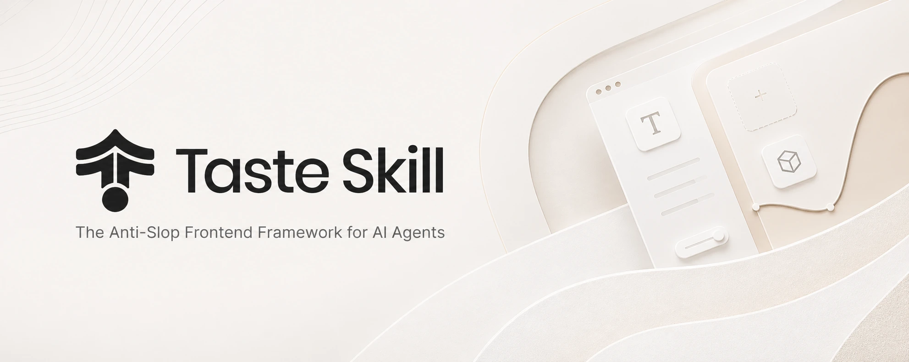
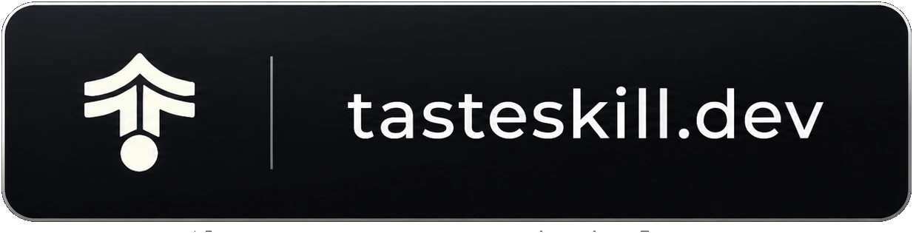
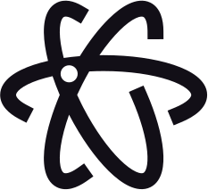
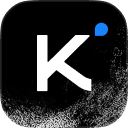
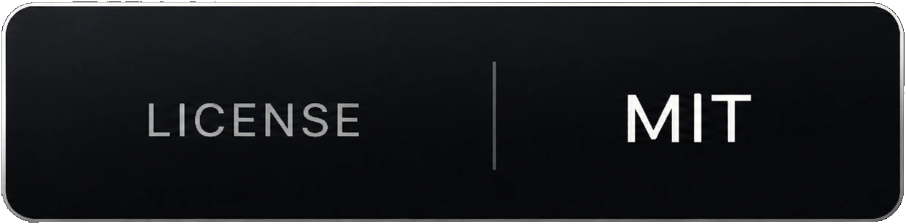
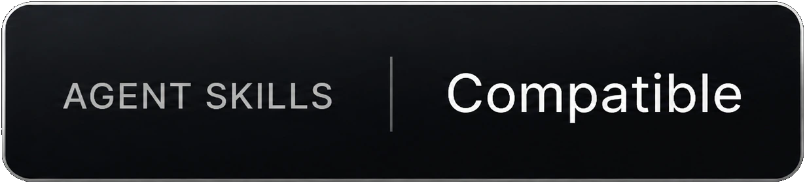
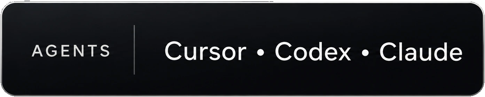

<p align="center">
  
</p>

<h1 align="center">Taste Skill</h1>

<p align="center">
  <em>Framework Frontend Anti-Slop untuk AI Agents</em>
</p>

<p align="center">
  <sub>🌐 <a href="README.md">English</a> | <strong>Bahasa Indonesia</strong></sub>
</p>

<p align="center" style="margin-bottom: 8px;">
  <a href="https://tasteskill.dev" title="Kunjungi tasteskill.dev"></a>
</p>

<p align="center">
  <a href="https://platform.kimi.ai?track_id=track-20f0d64bcaba419bb425a3e8c306f65d&aff=taste-skill">
    
  </a>
</p>

<p>Terima kasih kepada <strong>Kimi (Moonshot AI)</strong>, sahabat Open Source kami, atas dukungannya untuk taste-skill! Dengan 2,8T parameter, vision native, dan jendela konteks 1-juta token, <strong>Kimi K3</strong> menghadirkan performa frontier untuk coding jangka panjang, knowledge work, dan reasoning.</p>

<p><a href="https://platform.kimi.ai?track_id=track-20f0d64bcaba419bb425a3e8c306f65d&aff=taste-skill"><strong>Dapatkan kunci API Kimi</strong></a>. Pengguna taste-skill mendapatkan <strong>bonus kredit API 10%</strong> pada pembelian pertama.</p>

<h3 align="center">Sponsor</h3>

<table align="center">
  <tr>
    <td align="center" width="104">
      <a href="https://interfaces.dev/?utm_source=tasteskill&utm_medium=sponsorship">
        
      </a>
    </td>
    <td><sub><a href="https://interfaces.dev/?utm_source=tasteskill&utm_medium=sponsorship"><strong>interfaces.dev</strong></a> · Majalah design engineering oleh <a href="https://github.com/jakubkrehel"><strong>Jakub Krehel</strong></a></sub></td>
  </tr>
  <tr>
    <td align="center" width="104">
      <a href="https://reactbits.dev">
        <picture>
          <source media="(prefers-color-scheme: dark)" srcset="assets/sponsors/reactbits-icon-dark.svg" />
          
        </picture>
      </a>
    </td>
    <td><sub><a href="https://reactbits.dev"><strong>React Bits</strong></a> · Komponen React beranimasi untuk antarmuka kreatif</sub></td>
  </tr>
  <tr>
    <td align="center" width="104"><a href="https://animations.dev"></a></td>
    <td><sub><a href="https://github.com/emilkowalski"><strong>Emil Kowalski</strong></a> · <a href="https://animations.dev">animations.dev</a></sub></td>
  </tr>
  <tr>
    <td align="center" width="104"><a href="https://img.ly/"></a></td>
    <td><sub><a href="https://img.ly/"><strong>IMG.LY</strong></a> · CreativeEditor SDK</sub></td>
  </tr>
  <tr>
    <td align="center" width="104"><a href="https://www.sent.dm"></a></td>
    <td><sub><a href="https://www.sent.dm"><strong>Sent.dm</strong></a> · API messaging untuk SMS, WhatsApp, dan RCS</sub></td>
  </tr>
  <tr>
    <td align="center" width="104"><a href="https://www.kimi.com"></a></td>
    <td>
      <a href="https://www.kimi.com">
        <picture>
          <source media="(prefers-color-scheme: dark)" srcset="https://kimi-file.moonshot.cn/prod-chat-kimi/kfs/4/1/2026-06-05/1d8h69mt3v89kkekg24gg" />
          
        </picture>
      </a>
    </td>
  </tr>
  <tr>
    <td align="center" width="104"><a href="https://vercel.com/open-source-program"></a></td>
    <td><a href="https://vercel.com/open-source-program"></a></td>
  </tr>
</table>

<p align="center"><sub><a href="https://github.com/sponsors/Leonxlnx">Jadi sponsor</a></sub></p>

**Agent Skills** portabel yang meningkatkan antarmuka buatan AI: layout, tipografi, motion, dan spacing yang lebih kuat sebagai pengganti UI yang terlihat generik/boilerplate. Repo ini juga mencakup **skill pembuat gambar** untuk papan referensi (web, mobile, brand kit). Padukan dengan **ChatGPT Images** atau generator serupa, lalu serahkan frame hasilnya ke Codex, Cursor, atau Claude Code untuk diimplementasikan.

<p align="center">
  <a href="LICENSE"></a>
  &nbsp;
  <a href="https://github.com/vercel-labs/agent-skills"></a>
  &nbsp;
  <a href="#instalasi"></a>
  &nbsp;
  <a href="https://www.tasteskill.dev/changelog"></a>
</p>

## Penafian

Taste Skill tidak memiliki token, koin, atau proyek crypto resmi. Token apa pun yang menggunakan nama, gambar, atau proyek saya tidak terafiliasi dan tidak didukung oleh saya.

<p align="center"><sub><a href="#penafian">Penafian</a> · <a href="#instalasi">Instalasi</a> · <a href="#skill">Skill</a> · <a href="#pengaturan-khusus-taste-skill">Pengaturan</a> · <a href="#contoh">Contoh</a> · <a href="#sponsor">Sponsor</a> · <a href="#riset">Riset</a> · <a href="#pertanyaan-umum">FAQ</a> · <a href="#lisensi">Lisensi</a></sub></p>

## Masukan & Kontribusi

Kami sangat menghargai masukan Anda. Saran dan laporan bug:

- Buka Pull Request atau Issue di GitHub  
- DM [@lexnlin](https://x.com/lexnlin) atau [@blueemi99](https://x.com/blueemi99)  
- Email kami di [hello@tasteskill.dev](mailto:hello@tasteskill.dev)

## Instalasi

CLI [`npx skills add`](https://github.com/vercel-labs/agent-skills) memindai folder `skills/` di repo ini, sehingga **semua skill di bawah (kode maupun pembuat gambar) diinstal dengan cara yang sama.**

```bash
npx skills add https://github.com/Leonxlnx/taste-skill
```

Instal satu skill saja berdasarkan **nama instalasi**-nya (field `name:` di dalam frontmatter SKILL, bukan nama folder):

```bash
npx skills add https://github.com/Leonxlnx/taste-skill --skill "design-taste-frontend"
```

Anda juga dapat menyalin file `SKILL.md` apa pun ke dalam proyek Anda atau menempelkannya ke percakapan ChatGPT / Codex.

### Memperbarui dari versi sebelumnya

` taste-skill` default (nama instalasi `design-taste-frontend`) kini adalah **v2 (eksperimental)**, penulisan ulang besar dari v1 asli. Jika Anda sudah menginstal v1, cukup jalankan kembali perintah instalasi maka Anda akan otomatis ter-upgrade:

```bash
npx skills add https://github.com/Leonxlnx/taste-skill --skill "design-taste-frontend"
```

Nama instalasi tidak berubah, jadi tidak perlu memperbarui skrip. File SKILL.md yang baru akan menggantikan yang lama di tempat yang sama.

Jika Anda bergantung pada perilaku persis v1 dan ingin menguncinya secara eksplisit:

```bash
npx skills add https://github.com/Leonxlnx/taste-skill --skill "design-taste-frontend-v1"
```

Lihat [CHANGELOG.md](CHANGELOG.md) untuk diff lengkap v1 ke v2 beserta alasannya.

## Skill

Setiap skill mengerjakan satu tugas; Anda tidak perlu semuanya sekaligus. **Skill implementasi** menghasilkan kode. **Skill pembuat gambar** hanya menghasilkan gambar referensi.

Kolom `Nama instalasi` adalah nilai persis yang Anda teruskan ke `--skill`.

| Skill (folder) | Nama instalasi | Deskripsi |
| --- | --- | --- |
| **taste-skill** | `design-taste-frontend` | 🆕 **v2 (eksperimental)** - penulisan ulang besar dari skill default. Membaca brief, menyimpulkan bahasa desain, menyetel tiga dial (VARIANCE / MOTION / DENSITY). Inferensi brief, pemetaan design-system, larangan keras em-dash, kerangka kode GSAP kanonis, protokol audit redesign, dan pemeriksaan pre-flight yang ketat. Sedang aktif dikembangkan menuju v2.0.0 stabil. |
| **taste-skill-v1** | `design-taste-frontend-v1` | v1 asli dari taste-skill, dipertahankan untuk proyek yang bergantung pada perilaku persisnya. Gunakan hanya jika v2 default merusak sesuatu yang spesifik di alur kerja Anda. |
| **gpt-tasteskill** | `gpt-taste` | Varian yang lebih ketat untuk GPT/Codex: variansi layout lebih tinggi, arahan GSAP lebih kuat, anti-slop yang agresif. |
| **image-to-code-skill** | `image-to-code` | Alur berbasis gambar: buat referensi situs, analisis, lalu implementasikan frontend agar sesuai. |
| **redesign-skill** | `redesign-existing-projects` | Untuk proyek yang sudah ada: audit UI terlebih dahulu, lalu perbaiki layout, spacing, hierarki, dan styling. |
| **soft-skill** | `high-end-visual-design` | UI yang halus, tenang, dan terkesan mahal dengan kontras lembut, whitespace lega, font premium, dan motion spring. |
| **output-skill** | `full-output-enforcement` | Saat model mengirimkan pekerjaan setengah jadi: output penuh, tanpa komentar placeholder. |
| **minimalist-skill** | `minimalist-ui` | UI produk editorial (nuansa Notion/Linear), palet warna terkendali, struktur yang rapi. |
| **brutalist-skill** | `industrial-brutalist-ui` | Bahasa visual mekanis yang kokoh: tipografi Swiss, kontras tajam, layout eksperimental. |
| **stitch-skill** | `stitch-design-taste` | Aturan yang kompatibel dengan Google Stitch, termasuk format ekspor `DESIGN.md` opsional. |

### Skill pembuat gambar

Ini hanya menghasilkan gambar desain (tanpa kode). Gunakan bersama ChatGPT Images, mode gambar Codex, atau agen apa pun yang dapat menghasilkan gambar.

| Skill (folder) | Nama instalasi | Deskripsi |
| --- | --- | --- |
| **imagegen-frontend-web** | `imagegen-frontend-web` | Komposisi website: hero, landing, multi-section dengan tipografi kuat, spacing, dan arahan seni anti-slop. |
| **imagegen-frontend-mobile** | `imagegen-frontend-mobile` | Layar dan alur mobile: iOS/Android/cross-platform, mockup, tipografi yang mudah dibaca, set yang koheren. |
| **brandkit** | `brandkit` | Papan brand-kit: arahan logo, palet, tipografi, dan aplikasi identitas lintas kategori. |

### Skill mana yang harus saya gunakan?

- Mulai dengan **taste-skill** untuk default umum yang paling aman. (Sekarang v2 eksperimental - lihat apa yang berubah di [CHANGELOG](CHANGELOG.md).)
- Jika Anda bergantung pada perilaku persis taste-skill original, instal **taste-skill-v1** sebagai gantinya.
- Gunakan **gpt-taste** ketika Anda menginginkan aturan yang lebih ketat berorientasi GPT/Codex serta penegakan motion/layout.
- Gunakan **image-to-code-skill** untuk alur kerja gambar → analisis → kode website.
- Gunakan **redesign-skill** untuk meningkatkan codebase yang sudah ada, bukan styling greenfield.
- Tambahkan **soft-skill**, **minimalist-skill**, atau **brutalist-skill** ketika arah visual sudah ditentukan.
- Tambahkan **output-skill** jika agen terus memotong output.
- Gunakan **imagegen-frontend-web**, **imagegen-frontend-mobile**, atau **brandkit** ketika deliverable-nya adalah **gambar** (komposisi, alur, papan identitas), lalu teruskan hasilnya ke agen coding Anda.

### Tips image-first

Untuk **image-to-code-skill**, nyatakan alurnya di dalam prompt, contoh: `ikuti skill: buat gambar, lalu analisis, lalu buat kode`.

### ChatGPT Images dan Codex

Lampirkan atau tempel **`imagegen-frontend-web`**, **`imagegen-frontend-mobile`**, atau **`brandkit`** dan minta frame yang Anda butuhkan, lalu berikan hasil render tersebut ke Codex, Cursor, atau Claude Code. Gunakan **image-to-code-skill** ketika Anda menginginkan satu alur kerja yang sekaligus menghasilkan referensi dan mengimplementasikan situs dalam kode.

## Pengaturan (khusus taste-skill)

Angka di bagian atas file adalah dial 1-10:

- **DESIGN_VARIANCE**: Eksperimen layout (lebih rendah: terpusat/bersih · lebih tinggi: asimetris/modern).
- **MOTION_INTENSITY**: Kedalaman animasi (lebih rendah: hover · lebih tinggi: scroll/magnetik).
- **VISUAL_DENSITY**: Informasi per viewport (lebih rendah: lega · lebih tinggi: dashboard padat).

## Contoh

Dibuat dengan taste-skill:

<p>
  
  
</p>

## Dukung proyek ini

Jika Taste Skill membantu Anda, pertimbangkan untuk menjadi sponsor:

[Sponsor di GitHub](https://github.com/sponsors/Leonxlnx)

### Sponsor Komunitas

<a href="https://github.com/dnakov"></a>
<a href="https://github.com/AkramReshad"></a>
<a href="https://github.com/ajmalaksar25"></a>
<a href="https://github.com/krikkkk"></a>
<a href="https://github.com/navanchauhan"></a>
<a href="https://github.com/robinebers"></a>
<a href="https://github.com/JKc66"></a>
<a href="https://github.com/u2393696078-rgb"></a>
<a href="https://github.com/a-human-created-this"></a>
<a href="https://github.com/AtharvaJaiswal005"></a>
<a href="https://github.com/ghughes7"></a>
<a href="https://github.com/mccun934"></a>
<a href="https://github.com/techmedic5"></a>
<a href="https://github.com/bytewerk-dev"></a>
<a href="https://github.com/LuisGot"></a>
<a href="https://github.com/oskar-collab"></a>

<p align="center">
 <a href="https://www.star-history.com/leonxlnx/taste-skill">
  <picture>
   <source media="(prefers-color-scheme: dark)" srcset="https://api.star-history.com/badge?repo=Leonxlnx/taste-skill&theme=dark" />
   <source media="(prefers-color-scheme: light)" srcset="https://api.star-history.com/badge?repo=Leonxlnx/taste-skill" />
   
  </picture>
 </a>
</p>

## Riset

Tulisan latar belakang yang membentuk skill-skill ini ada di [`research/`](research/).

## Pertanyaan Umum

**Apa bedanya dengan skill desain AI lainnya?**  
Beberapa varian khusus, dial yang dapat disesuaikan pada skill utama, aturan anti-repetisi yang didasarkan pada riset khusus. Semuanya agnostik terhadap framework dan kompatibel dengan agen coding utama.

**Apakah bisa dipakai dengan React, Vue, Svelte?**  
Ya. Aturannya menargetkan niat desain, bukan API framework tertentu.

**Apa itu SKILL.md?**  
File instruksi portabel yang dapat dimuat agen secara otomatis; instal via `npx skills add` atau dengan menyalin ke repo atau percakapan.

**Apakah skill pembuat gambar ikut terinstal dengan `npx skills add`?**  
Ya. Mereka berada di bawah `skills/` bersama skill kode sehingga CLI yang sama dapat menemukannya.

## Lisensi

[Lisensi MIT](LICENSE) · Hak Cipta (c) 2026 Leonxlnx
