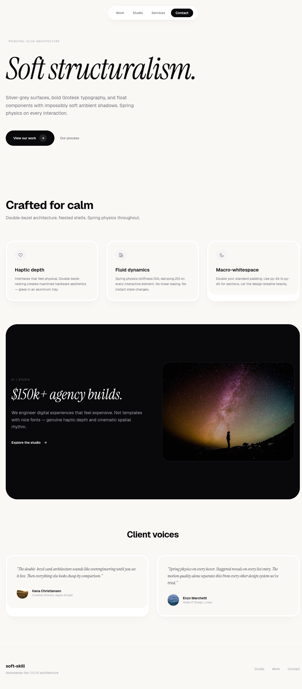
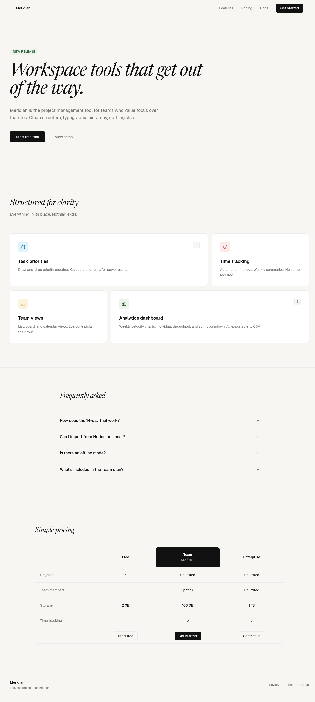
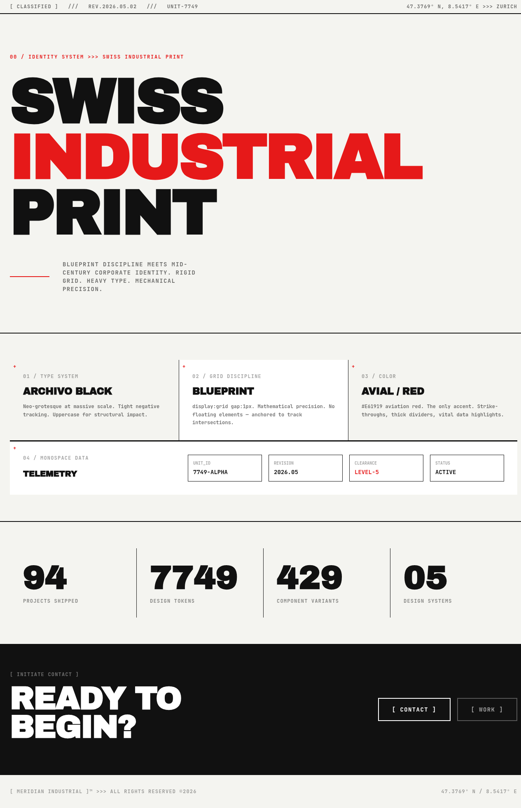
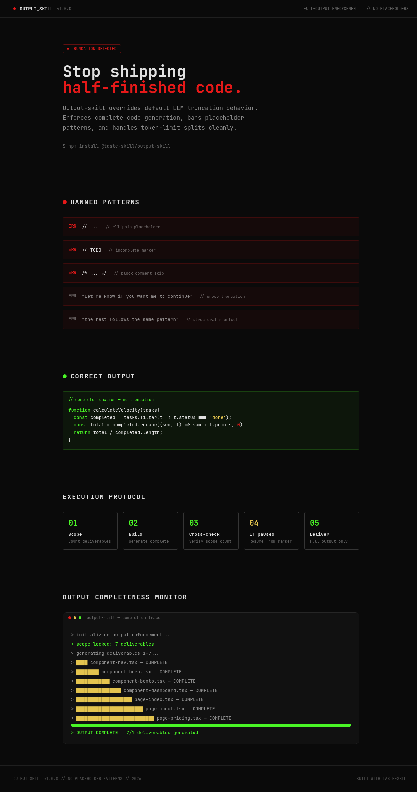

# taste-skill Showcase

Visual examples of each skill in the [taste-skill](https://github.com/leonxlnx/taste-skill) ecosystem. One HTML file per skill, screenshot included.

---

## Skills

### 1. taste-skill — Anti-Slop Frontend Framework
High-agency frontend rules: motion engine, bento grid, skeleton loaders, spring physics.

**File:** `1-taste-skill.html`


---

### 2. gpt-taste — Awwwwards-Level GSAP Motion
Ultra-wide container heroes, GSAP ScrollTrigger, grid-flow-dense, inline image typography.

**File:** `2-gpt-taste.html`


---

### 3. soft-skill — Principal UI/UX Architecture
Double-bezel card architecture, spring physics, warm cream surfaces, macro-whitespace.

**File:** `3-soft-skill.html`


---

### 4. minimalist-skill — Editorial Product UI
Newsreader serif + Geist pairing, pale pastel palette, accordion FAQ, clean pricing table.

**File:** `4-minimalist-skill.html`


---

### 5. brutalist-skill — Swiss Industrial Print
Archivo Black uppercase, blueprint grid, aviation red #E61919 accents, monospace telemetry.

**File:** `5-brutalist-skill.html`


---

### 6. output-skill — Full-Output Enforcement
Terminal-style developer tool, banned pattern errors in red, correct output in green.

**File:** `6-output-skill.html`


---

### 7. redesign-skill — Design Audit & Upgrade System
Before/after comparison, upgrade priority flow, 7-step audit checklist.

**File:** `7-redesign-skill.html`


---

### 8. stitch-skill — Semantic Design System
DESIGN.md generator visualization: atmosphere dials, color palette roles, typography rules, anti-patterns.

**File:** `8-stitch-skill.html`


---

## Run locally

```bash
# Open any file directly in a browser
open 1-taste-skill.html

# Or serve with a simple server
python3 -m http.server 8000
# Then visit http://localhost:8000
```

## View on GitHub Pages

Coming soon — the showcase repo will be deployed to GitHub Pages for easy sharing.
